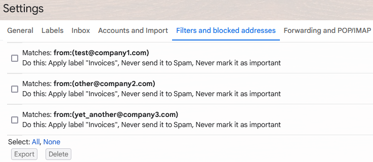
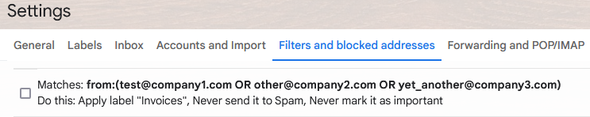

# Gmail filter squasher


Personal project to merge multiple filters with the same action but different "from:" addresses on their criteria. 

So basically it's a tool that takes these filters:



And merges them into a single one:



Note that only merges filters were the criteria is a "from" statement and they have a matching action. Nevertheless, I can accept PRs considering other merging criterias.

## Prerequisites

To run this application, you need the following prerequisites:

* Python 3.10.7 or greater.
* The pip package management tool.
* A Google Cloud project.
* A Google account with Gmail enabled.

## Setup

The following instructions are based mostly on [the official quickstart][1]:

1. Create a GCP Project.
2. Enable the [Gmail API][2].
3. Configure the OAuth consent screen.
   1. Go to the [consent screen menu][3].
   2. If you can create an "internal" one, do it. Otherwise select "external".
   3. File all the required information and continue.
   4. If you selected external, you have to:
      1. Add a scope. Search for "Gmail API" and select ".../auth/gmail.settings.basic".
            This scope allows to see, edit, create, or change email settings and filters in Gmail; and it's the minimum scope we can make use of.
      2. Add a test user. Add the gmail account you want to squash the filters from.
   5. After reviewing the summary, save the changes.
4. Create credentials for a desktop application.
   1. Go to the [credentials screen][4].
   2. Create an OAuth client ID credential for a desktop app.
   3. The OAuth client created screen appears, showing your new Client ID and Client secret.
   4. Download the JSON file.
   5. Move the JSON file to this directory, at the same level as "[gmail_filter_squasher.py](./gmail_filter_squasher.py)". Rename it to "credentials.json"; or in the Python code change the value of `CREDENTIALS_FILE` to that file's name.


## Execution

To execute it, I'd suggest creating a virtual environment to install the necessary dependencies:
```
python -m venv venv
source venv/bin/activate
pip install -r requirements.txt
```

To run the program as is, simply use:
```
python gmail_filter_squasher.py
```

However, with the current configuration that **will not apply** any changes into Gmail. As a cautionary measure, the first run should simply be a preview of what will be applied.

At the beginning of [the script](./gmail_filter_squasher.py), a few variables are declared. The most important ones being these two:

```python
# Debug mode. If True, no changes will be applied into Gmail
DEBUG = True
# Verbosity mode. If True, extra logs will be output
VERBOSE_MODE = False
```

My suggestion is to run the script in debug mode and without the extra verbosity. If you do not understand the new filters, set `VERBOSE_MODE = True` to get some extra output as that might explain the original filters and what they will become once merged.

Once the output plan seems acceptable to you, feel free to set `DEBUG = False` and run the script again to apply the changes.


[1]: https://developers.google.com/gmail/api/quickstart/python#set_up_your_environment
[2]: https://console.cloud.google.com/flows/enableapi?apiid=gmail.googleapis.com
[3]: https://console.cloud.google.com/apis/credentials/consent
[4]: https://console.cloud.google.com/apis/credentials